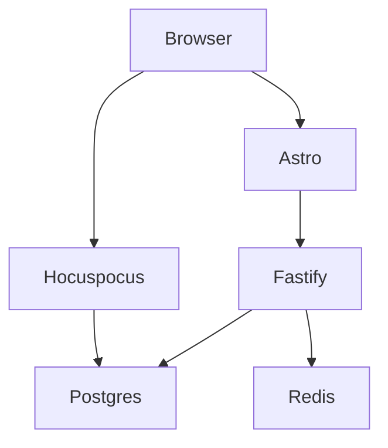

# Acolyte — Architecture

## Process layout

Two long-lived processes plus shared data:



## Data flow on edit

1. Browser edits the doc
2. y-prosemirror produces a Yjs update (binary)
3. Update broadcasts via WSS to Hocuspocus
4. Hocuspocus applies to in-memory Y.Doc
5. Debounce (3s idle / 15s ceiling)
6. `onStoreDocument` runs the canonical write transaction:

```sql
UPDATE docs SET
  yjs_state    = $1,
  markdown     = $2,
  content_hash = $3,
  updated_by   = $4,
  updated_at   = now()
WHERE id = $5
```

## What lives where

| Component | Process       | Port |
| --------- | ------------- | ---- |
| Web UI    | Astro         | 5173 |
| REST API  | Fastify       | 8080 |
| Collab    | Hocuspocus    | 1234 |
| DB        | Postgres 16   | 5432 |
| Cache     | Redis 7       | 6379 |

## Deployment

Production runs on Fly with two `[processes]` in one app — `api` and `collab`. Both share `apps/api`'s codebase and import the same `@boppl/schema` package for the markdown ↔ Y.Doc bridge.
