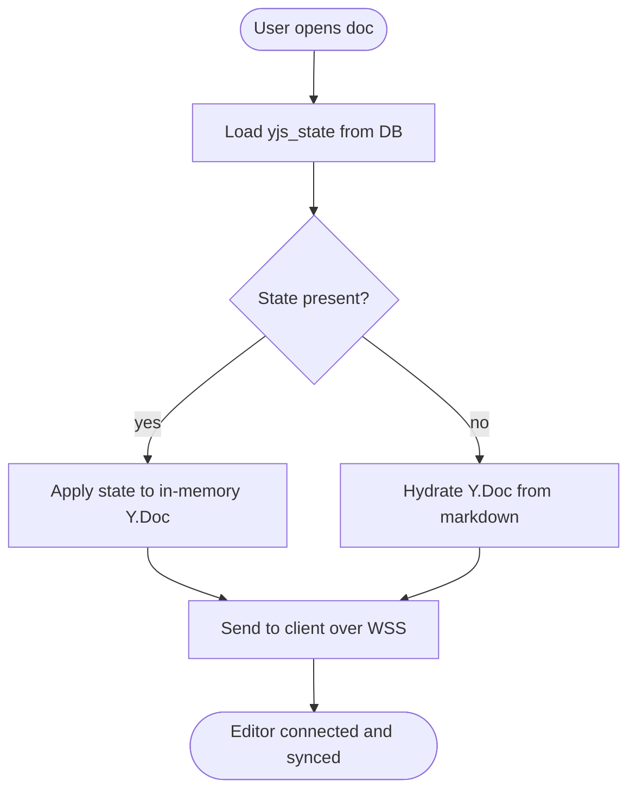

# Mermaid flowchart

```mermaid
flowchart TD
  Start([User opens doc]) --> Load[Load yjs_state from DB]
  Load --> HasState{State present?}
  HasState -- yes --> Apply[Apply state to in-memory Y.Doc]
  HasState -- no --> Hydrate[Hydrate Y.Doc from markdown]
  Apply --> Sync[Send to client over WSS]
  Hydrate --> Sync
  Sync --> Idle([Editor connected and synced])
```
