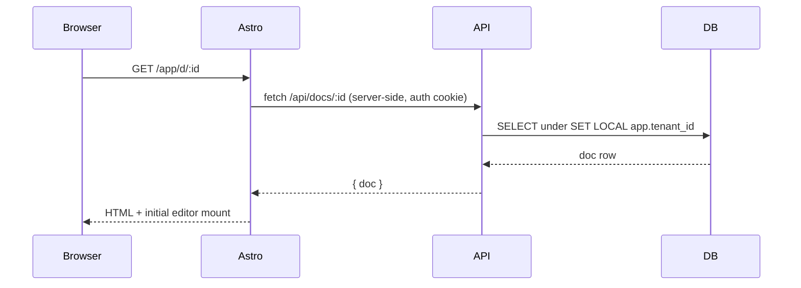

# Mermaid sequence diagram

```mermaid
sequenceDiagram
  participant Browser
  participant Astro
  participant API
  participant DB

  Browser->>Astro: GET /app/d/:id
  Astro->>API: fetch /api/docs/:id (server-side, auth cookie)
  API->>DB: SELECT under SET LOCAL app.tenant_id
  DB-->>API: doc row
  API-->>Astro: { doc }
  Astro-->>Browser: HTML + initial editor mount
```
