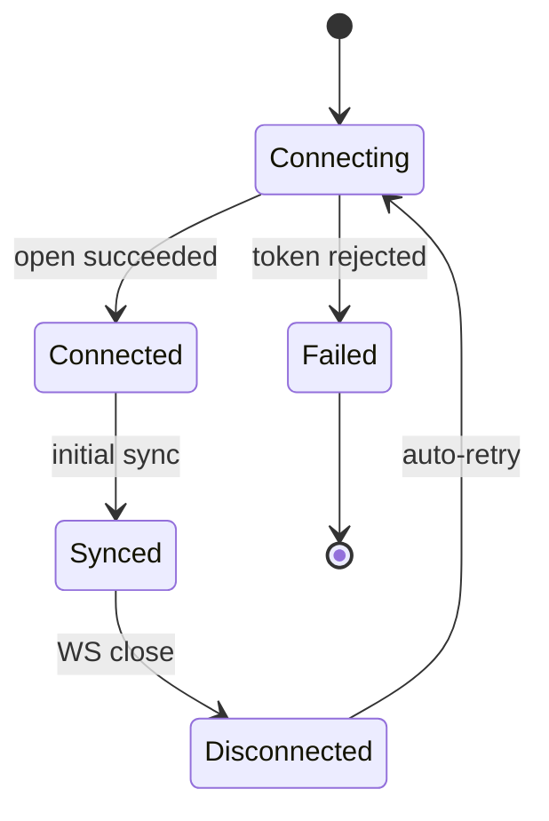

# Mermaid state diagram

```mermaid
stateDiagram-v2
  [*] --> Connecting
  Connecting --> Connected: open succeeded
  Connecting --> Failed: token rejected
  Connected --> Synced: initial sync
  Synced --> Disconnected: WS close
  Disconnected --> Connecting: auto-retry
  Failed --> [*]
```
