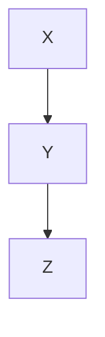

# Multiple mermaid blocks

```mermaid
graph TD
  A --> B
```

Some explanatory text between two diagrams.

```mermaid
graph LR
  Start --> End
```

A third diagram lower down:

```mermaid
graph TB
  X --> Y
  Y --> Z
```
