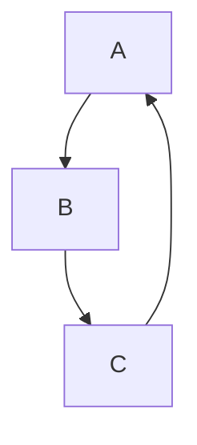

# Pathological kitchen sink

Top-level paragraph with **bold**, *italic*, ~~strike~~, `code`, [link](https://example.com), inline math $E = mc^2$, and an autolink <https://example.org>.

## Section one

A paragraph then a quote:

> A blockquote with a [link inside](https://example.com) and **bold** for spice.
>
> A second line of the quote.

A nested list:

- top
  - nested
    - deep
      - deeper
  - back at two
- next top
  1. ordered nested under bullet
  2. another
- end top

A code fence with content:

```typescript
function pathological(input: string): string {
  return input.split('').reverse().join('');
}
```

Inline math next to display math:

The Pythagorean theorem $a^2 + b^2 = c^2$ in display:

$$
a^2 + b^2 = c^2
$$

A table:

| col one | col two |
| ------- | ------- |
| **bold**| `code`  |
| ~~s~~   | *italic*|

A mermaid diagram:



A horizontal rule:

---

A task list:

- [ ] todo one
- [x] done two
- [ ] todo three

A reference link [used here][r] with the definition at the bottom.

A second display math:

$$
\sum_{i=1}^{n} i = \frac{n(n+1)}{2}
$$

End paragraph with one more **bold** for good measure.

[r]: https://example.com/ref
